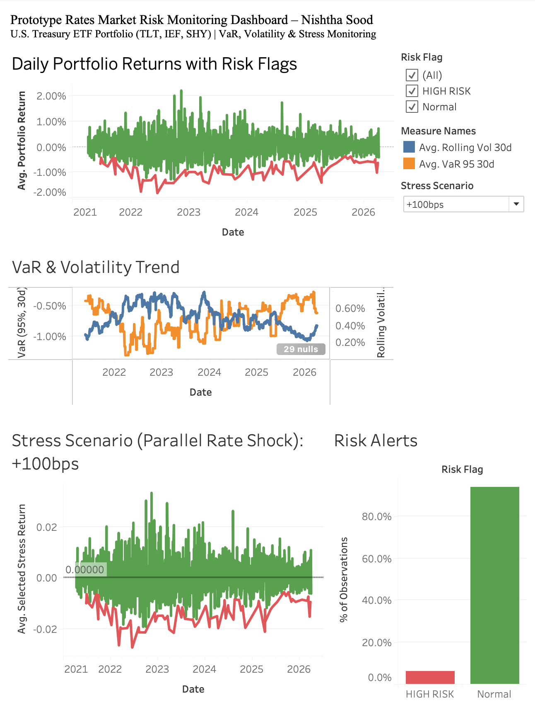
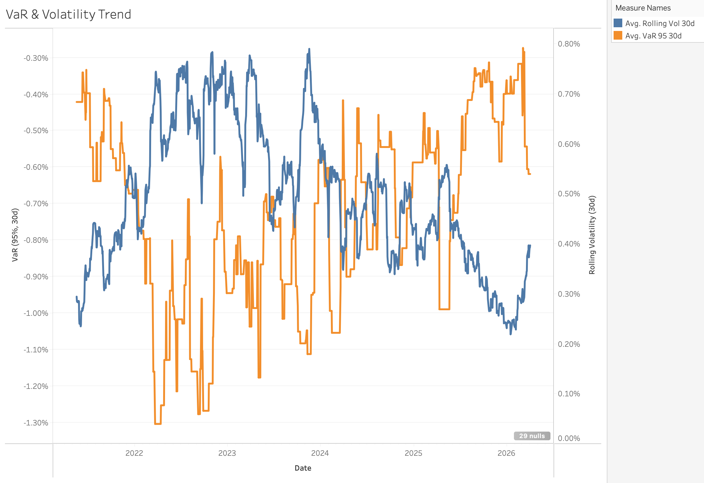
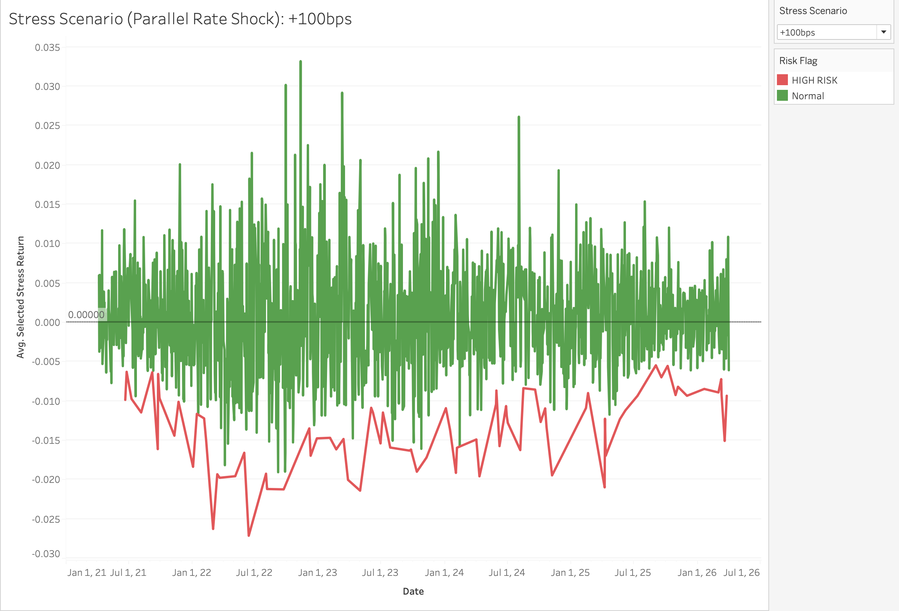

# Interactive Market Risk Monitoring Dashboard (Tableau + Python)

**Project for JPMorgan Chase – North America Rates Market Risk Associate Role**

Built an interactive Tableau dashboard with Python data pipeline for monitoring a multi-asset Rates portfolio. Includes real-time risk metrics, threat alerts, and stress scenario analysis.

### Features
- Portfolio P&L and VaR trends with rolling calculations
- Stress scenario selector (+50bps / +100bps parallel shifts)
- Color-coded risk flags and proactive threat detection
- Risk sensitivity visualizations

### Technologies
- Python (pandas, yfinance) for data pipeline
- Tableau Public for interactive dashboard

### Live Dashboard
View on Tableau Public : https://public.tableau.com/app/profile/nishtha.sood/viz/MarketRiskMonitoringDashboardNishthaSood/PrototypeRatesMarketRiskMonitoringDashboard?publish=yes

## Dashboard Preview

### Overview

### VaR & Volatility

### Stress Scenario

### Why This Project?
Matches the JD requirement to “build an enhanced risk monitoring framework” and “pro-actively bring threats and weaknesses to the attention of the trading business.” Demonstrates ability to deliver visual risk advisory tools for the North America Rates desk.

Repository: https://github.com/nishtha-sood/market-risk-monitoring-dashboard
